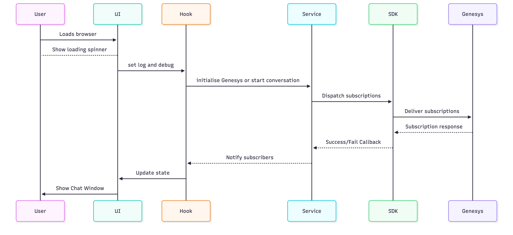
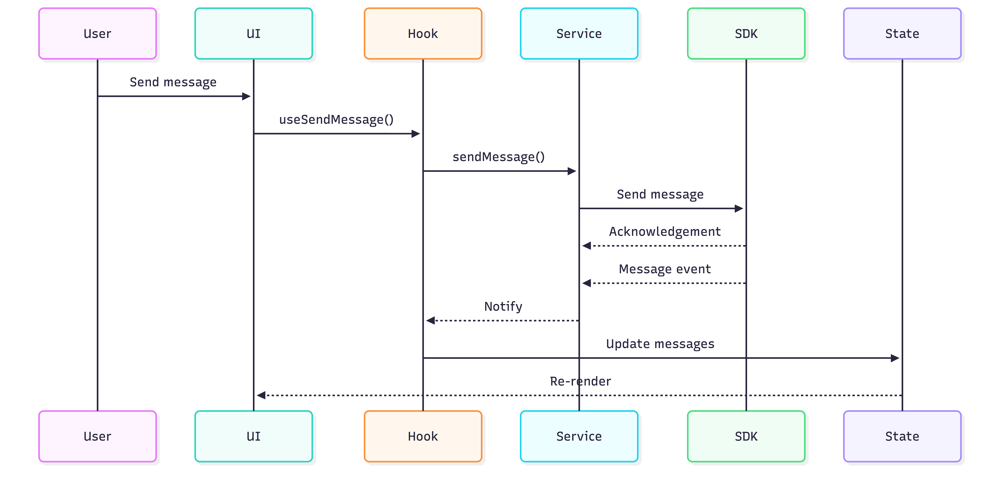
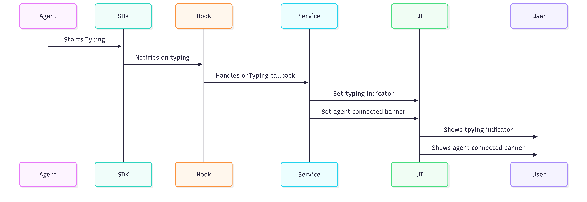
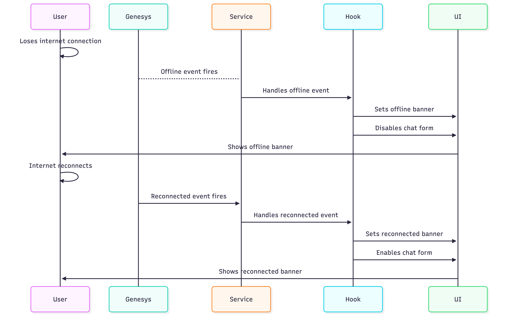
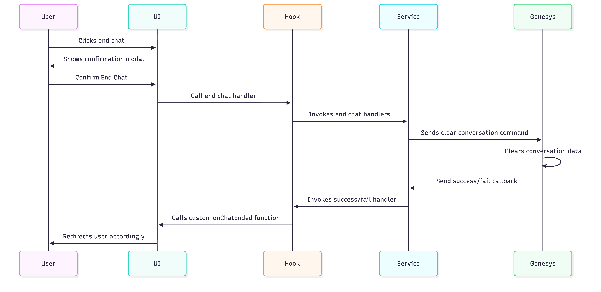
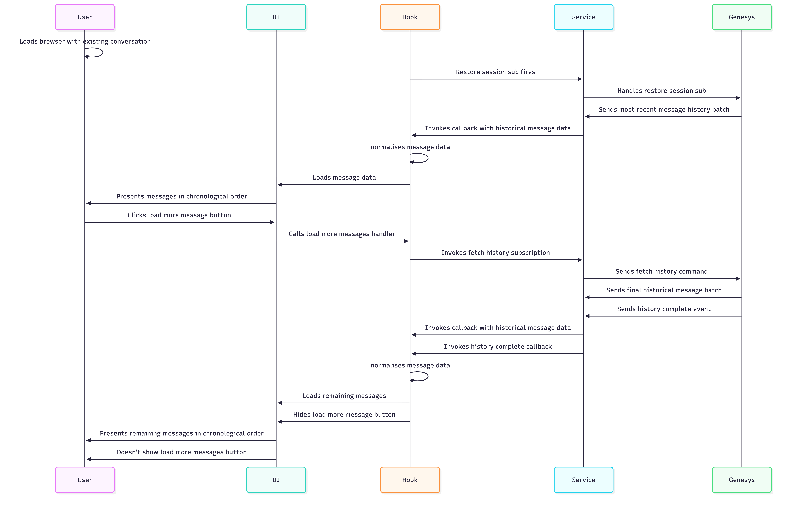

# HOF Genesys Chat Component

> **Production Documentation · v1.0 · March 2026**
>
> This guide covers every aspect of the HOF Genesys Chat Component: SDK integration, component API, state management, custom hooks, ref usage, event subscription flows, stateful lifecycle diagrams, and consuming the library from another service.

---

## Table of Contents

1. [Library Overview](#1-library-overview)
   - [1.1 Key Features](#11-key-features)
   - [1.2 Architectural Layers](#12-architectural-layers)
   - [1.3 Directory Structure](#13-directory-structure)
2. [Genesys SDK Integration](#2-genesys-sdk-integration)
   - [2.1 SDK Loading](#21-sdk-loading)
   - [2.2 Conversation Lifecycle](#22-conversation-lifecycle)
   - [2.3 Session Persistence Strategy](#23-session-persistence-strategy)
   - [2.4 GenesysService API Reference](#24-genesysservice-api-reference)
3. [GenesysChatComponent — Props API](#3-genesyschatcomponent--props-api)
   - [3.1 Required Props](#31-required-props)
   - [3.2 Optional Props](#32-optional-props)
   - [3.3 serviceMetadata Object](#33-servicemetadata-object)
   - [3.4 Minimal Usage Example](#34-minimal-usage-example)
4. [State Management](#4-state-management)
   - [4.1 useChatState — State Inventory](#41-usechatstate--state-inventory)
   - [4.2 Ref Usage](#42-ref-usage)
5. [Custom Hooks Reference](#5-custom-hooks-reference)
   - [5.1 useGenesysInitialization](#51-usegenesysinitialization)
   - [5.2 useGenesysSubscriptions](#52-usegenesyssubscriptions)
   - [5.3 useChatUI](#53-usechatui)
   - [5.4 useChatActions](#54-usechatactions)
   - [5.5 useSendMessage — Structured Message Handling](#55-usesendmessage--structured-message-handling)
6. [Message Rendering Pipeline](#6-message-rendering-pipeline)
   - [6.1 Component Resolution](#61-component-resolution)
   - [6.2 Message Component Summary](#62-message-component-summary)
   - [6.3 Structured / Quick-Reply Message Lifecycle](#63-structured--quick-reply-message-lifecycle)
7. [Stateful Interaction Flows](#7-stateful-interaction-flows)
   - [7.1 Initialisation Flow](#71-initialisation-flow)
   - [7.2 Message Send Flow](#72-message-send-flow)
   - [7.3 Agent Typing Flow](#73-agent-typing-flow)
   - [7.4 Offline / Reconnect Flow](#74-offline--reconnect-flow)
   - [7.5 End Chat Flow](#75-end-chat-flow)
   - [7.6 History Load Flow](#76-history-load-flow)
8. [Banner Message System](#8-banner-message-system)
9. [Utility Modules](#9-utility-modules)
   - [9.1 message-utils.js](#91-message-utilsjs)
   - [9.2 quick-replies.js](#92-quick-relpyjs)
   - [9.3 conversation-storage.js](#93-conversation-storagejs)
10. [Integrating in a Consuming Service](#10-integrating-in-a-consuming-service)
    - [10.1 Prerequisites](#101-prerequisites)
    - [10.2 Installation](#102-installation)
    - [10.3 Logging Integration](#103-logging-integration)
    - [10.4 onChatEnded Callback](#104-onchatended-callback)
    - [10.5 Custom Error Component](#105-custom-error-component)
    - [10.6 localStorageKey Uniqueness](#106-localstorage-key-uniqueness)
    - [10.7 CSS / Styling](#107-css--styling)
    - [10.8 Exported Utilities](#108-exported-utilities)
    - [10.9 ConversationProvider](#109-conversationprovider)
11. [Known Behaviours & Edge Cases](#11-known-behaviours--edge-cases)
12. [Development](#12-development)

---

## 1. Library Overview

## Overview

The Genesys Chat Library is a self-contained React component library that wraps the Genesys Web Messaging SDK. It provides a fully stateful, production-ready live-chat UI that any consuming service can embed with a minimal API surface.

### 1.1 Key Features

- **Modular Architecture**: Separated concerns with custom hooks for state, subscriptions, actions, and UI
- **Full React 19 Support**: Functional components, hooks, context-based architecture
- **Genesys Integration**: Seamless integration with Genesys Messenger SDK
- **Accessibility**: WCAG 2.1 compliant with built-in accessibility testing
- **Offline Support**: Handles disconnections and reconnections gracefully
- **Message History**: Loads and displays conversation history
- **GovUK Design System**: Styled with GovUK frontend framework

### 1.2 Architectural Layers

The library is organised into four distinct layers, each with a clearly bounded responsibility:

| Layer | Modules | Responsibility |
|---|---|---|
| **SDK Abstraction** | `genesys-service.js` | Wraps all `globalThis.Genesys()` calls. Consuming code never touches the SDK directly. |
| **State** | `use-chat-state.js` | Single source of truth for all reactive state and refs used across the component tree. |
| **Subscriptions & Events** | `use-genesys-subscriptions.js`, `use-genesys-initialisation.js` | Manages SDK lifecycle: script injection, conversation start, and all event subscriptions. |
| **UI & Actions** | `GenesysChatComponent`, chat hooks, message components | Renders messages, handles input, and routes user actions to the service layer. |

### 1.3 Directory Structure

```
src/
├── index.js                          ← Barrel export
├── services/
│   └── genesys-service.js            ← SDK abstraction singleton
├── hooks/
│   ├── use-chat-state.js             ← All state & refs
│   ├── use-chat-ui.js                ← Scroll & history merge
│   ├── use-genesys-initialisation.js ← SDK boot
│   ├── use-genesys-subscriptions.js  ← Event wiring
│   ├── chat/
│   │   ├── use-chat-actions.js       ← Action façade
│   │   ├── use-send-message.js
│   │   ├── use-quick-reply.js
│   │   ├── use-end-chat.js
│   │   └── use-message-history.js
│   └── helpers/
│       └── agent-banner-logic.js
├── components/
│   ├── genesys-chat-component.jsx    ← Public entry component
│   ├── chat/
│   │   ├── chat-form.jsx
│   │   └── end-chat-modal.jsx
│   └── message/
│       ├── messages.jsx
│       ├── message-renderer.jsx
│       ├── message-text.jsx
│       ├── message-meta.jsx
│       ├── typing-indicator.jsx
│       ├── agent-connected.jsx
│       ├── load-more-messages.jsx
│       ├── delegates/
│       │   ├── message-registry.js
│       │   └── message-wrapper.jsx
│       └── types/
│           ├── inbound-message.jsx
│           ├── outbound-message.jsx
│           ├── banner-message.jsx
│           └── structured-message.jsx
├── conversation/
│   ├── conversation-provider.js
│   └── conversation-storage.js
└── utils/
    ├── genesys-agent.js
    ├── message-utils.js
    ├── quick-replies.js
    └── text-counter.js
```

---

## 2. Genesys SDK Integration

For detailed Genesys flows, see the [genesys overview](./docs/genesys-overview.md)

### 2.1 SDK Loading

The library injects the Genesys Web Messaging bootstrap script into the document head at component mount time. This is handled by `GenesysService.loadGenesysScript()` and called once by `useGenesysInitialization`.

```js
// genesys-service.js — loadGenesysScript(environment, deploymentId)
globalThis._genesysJs = 'Genesys';
globalThis.Genesys = globalThis.Genesys || function () {
  (globalThis.Genesys.q = globalThis.Genesys.q || []).push(arguments);
};
globalThis.Genesys.t = 1 * new Date();
globalThis.Genesys.c = { environment, deploymentId, debug: this.debugMode };

const script = document.createElement('script');
script.src = 'https://apps.euw2.pure.cloud/genesys-bootstrap/genesys.min.js';
script.async = true;
document.head.appendChild(script);
```

> **ℹ Note:** If `globalThis.Genesys` is already present (e.g. the user navigated back via browser history), script injection is skipped and the conversation is resumed directly.

### 2.2 Conversation Lifecycle

Conversation initialisation follows a strict ordered sequence mandated by the Genesys SDK:

1. Subscribe to `MessagingService.ready` — the SDK raises this once the script has bootstrapped.
2. Within the ready callback: check `localStorage` for an existing session key. If found, fire `onGenesysReady()` immediately. If not, call `MessagingService.startConversation`.
3. Register session-clearing subscriptions (`sessionCleared`, `conversationReset`, `conversationCleared`) — these remove the `localStorage` key whenever Genesys invalidates the session.

### 2.3 Session Persistence Strategy

The library tracks whether a Genesys conversation is active using a caller-supplied `localStorage` key. This decouples session tracking from the Genesys SDK internal state, giving the consuming service full control over the key name.

| Storage | Key | Contents | Cleared when |
|---|---|---|---|
| `localStorage` | `serviceMetadata.localStorageKey` | `"true"` (session active flag) | User ends chat, or SDK fires a session-clearing event |
| `sessionStorage` | `"conversationId"` | UUID v4 per session | User ends chat (`removeConversationId()`) |

### 2.4 GenesysService API Reference

`GenesysService` is exported as a singleton (`genesysService`). All hooks call it via import — consuming services should not need to call it directly except for optional configuration.

| Method | Parameters | Description |
|---|---|---|
| `setLogger(fn)` | `fn: ({level, message, metadata}) => void` | Attaches a custom logging callback. Called automatically from `GenesysChatComponent` when `loggingCallback` prop is supplied. |
| `setDebugMode(bool)` | `bool: boolean` | Enables Genesys SDK debug output. Called automatically from `GenesysChatComponent` when `debugMode` prop is supplied. |
| `loadGenesysScript(env, id)` | `environment: string, deploymentId: string` | Injects the Genesys bootstrap script. Called once by `useGenesysInitialization`. |
| `initialiseGenesysConversation(onReady, onError, key)` | Callbacks + localStorage key | Subscribes to `MessagingService.ready` and starts or resumes a conversation. |
| `startConversation(key, onError, onReady)` | Callbacks + localStorage key | Issues `MessagingService.startConversation` command. |
| `sendMessageToGenesys(message, onError)` | `message: string, onError: fn` | Sends a user message via `MessagingService.sendMessage`. |
| `fetchMessageHistory(onError)` | `onError: fn` | Triggers `MessagingService.fetchHistory` to load older messages. |
| `clearConversation(key)` | `key: string` | Clears the Genesys conversation and removes `localStorage`/`sessionStorage` entries. |
| `subscribeToGenesysMessages(cb)` | `cb: (messages[]) => void` | Receives new live messages as they arrive. |
| `subscribeToGenesysOldMessages(cb, onComplete)` | Two callbacks | Receives paginated history batches and fires `onComplete` when all history is loaded. |
| `subscribeToSessionRestored(cb)` | `cb: (data) => void` | Fires on page refresh/reload with the most recent 25 messages. |
| `subscribeToGenesysReconnected(cb)` | `cb: () => void` | Fires when WebSocket reconnects after a drop. |
| `subscribeToGenesysOffline(cb)` | `cb: () => void` | Fires when WebSocket connection is lost. |
| `subscribeAgentTyping(cb)` | `cb: () => void` | Fires on `typingReceived` (agent has started typing). |
| `unSubscribeAgentTyping(cb)` | `cb: () => void` | Fires on `typingTimeout` (agent stopped typing). |
| `subscribeToErrors(cb)` | `cb: (data) => void` | Fires on any `MessagingService.error` event. |
| `registerForSessionClearingEvents(key)` | `key: string` | Subscribes to all three session-clearing events and removes `localStorage` key on each. |

---

## 3. GenesysChatComponent — Props API

`GenesysChatComponent` is the single public UI entry point. Import it from the library and render it.

### 3.1 Required Props

| Prop | Type | Description |
|---|---|---|
| `genesysEnvironment` | `string` | Genesys Cloud region domain (e.g. `"mypurecloud.com"`, `"euw2.pure.cloud"`). |
| `deploymentId` | `string` | The Genesys Messenger deployment ID for your environment. |
| `onChatEnded` | `Function` | `() => {}` | Callback fired after the user confirms ending the chat. Use this to redirect or update parent state. |
| `errorComponent` | `ReactNode` | `{}` | Custom component rendered when `isErrorState` becomes `true` (Genesys SDK error or send failure). |
| `loadingSpinner` | `ReactNode` | `undefined` | Component rendered while Genesys is initialising (`genesysIsReady === false`). |
| `serviceMetadata` | `object` | `{}` | Service-specific config object. See [Section 3.3](#33-servicemetadata-object). |

### 3.2 Optional Props

| Prop | Type | Default | Description |
|---|---|---|---|
| `loggingCallback` | `Function` | `() => {}` | Receives structured log events: `{ level, message, metadata }`. Wire to your service logger or analytics. |
| `maxCharacterLimit` | `number` | `4096` | Maximum characters allowed per user message. Matches Genesys message limit. Enforced via UI disable + error style. |
| `debugMode` | `boolean` | `false` | Passes `debug: true` to the Genesys SDK configuration for verbose SDK logging. |

### 3.3 serviceMetadata Object

| Key | Type | Default | Description |
|---|---|---|---|
| `localStorageKey` | `string` | `"genesys_chat_session"` | Key used to flag an active session in `localStorage`. Must be unique per service to avoid cross-service collisions. |
| `serviceName` | `string` | `""` | Lowercase service identifier (e.g. `"euss"`, `"eta"`). Passed to logging and action hooks for audit context. |
| `agentConnectedText` | `string` | `"You are now connected to an agent."` | Banner text injected into the message list when an agent joins. |
| `agentDisconnectedText` | `string` | `"The agent has disconnected."` | Banner text injected when a `Presence.Disconnect` event is detected. |
| `offlineText` | `string` | `"You are offline. Please check your connection."` | Banner text appended when WebSocket goes offline. |
| `onlineText` | `string` | `"You are back online."` | Banner text appended when WebSocket reconnects. |
| `utmParams` | `string` | `""` | UTM parameter string appended to links rendered inside messages (for analytics link tracking). |
| `botMetaDisplay` | `string` | `"Digital assistant"` | Display name shown below outbound bot messages in the meta line. |

### 3.4 Minimal Usage Example

```jsx
import { GenesysChatComponent } from 'hof-genesys-chat-component';

export default function ChatPage() {
  return (
    <GenesysChatComponent
      genesysEnvironment="euw2.pure.cloud"
      deploymentId="xxxxxxxx-xxxx-xxxx-xxxx-xxxxxxxxxxxx"
      serviceMetadata={{
        localStorageKey: "my_service_chat_session",
        serviceName: "my-service",
        agentConnectedText: "An adviser has joined the chat.",
        botMetaDisplay: "Help assistant",
      }}
      onChatEnded={() => navigate("/chat-ended")}
      loggingCallback={(log) => analyticsService.log(log)}
      loadingSpinner={<Spinner />}
      errorComponent={<ErrorBanner />}
    />
  );
}
```

---

## 4. State Management

### 4.1 useChatState — State Inventory

All reactive state lives in `useChatState`. `GenesysChatComponent` destructures it and distributes specific slices to the hooks and components that need them, keeping concerns separated.

| State / Ref | Type | Purpose |
|---|---|---|
| `userInput` | `string` | Controlled value of the textarea. Cleared to `""` after each send. |
| `messages` | `Message[]` | Live message list — all messages the SDK has delivered this session, plus banner objects. |
| `historicalMessages` | `Message[]` | Accumulates historical message batches fetched from Genesys. Used for the "Load more" flow. |
| `genesysIsReady` | `boolean` | `true` once the SDK has raised `MessagingService.ready` and a conversation exists. Gates all subscription effects. |
| `allHistoryFetched` | `boolean` | Set `true` on `MessagingService.historyComplete`. Hides the "Load more messages" button. |
| `shouldScrollToLatestMessage` | `boolean` | When `true`, `useChatUI` scrolls `lastMessageRef` into view. Reset after scroll. |
| `agentIsTyping` | `boolean` | Controls visibility of the `TypingIndicator` component. |
| `isErrorState` | `boolean` | When `true`, renders `errorComponent` and hides the chat UI. |
| `lastQuickReplyMessageIndex` | `number` | Index of the last quick reply in the `messages` array. `-1` when none. Used to hide previous quick-reply buttons on send. |
| `showEndChatModal` | `boolean` | Controls visibility of the `EndChatModal` confirmation dialog. |
| `isOffline` | `boolean` | When `true`, disables the textarea and Send/End Chat buttons. |
| `lastHistoryBatchCount` | `number` | The count of messages in the most recent history batch. Shows "Load more" when `=== 25`. |
| `hasReconnectedRef` | `Ref<boolean>` | Ref (not state) — tracks whether a WebSocket reconnection occurred. Prevents the session-restored handler from re-applying messages on reconnect. |
| `lastMessageRef` | `Ref<HTMLElement>` | Ref attached to the last text-bearing message element. Used by `useChatUI` to scroll it into view. |

### 4.2 Ref Usage

Two refs are used to coordinate behaviour that must not trigger re-renders.

#### `hasReconnectedRef`

This ref guards the `subscribeToSessionRestored` handler. When Genesys reconnects after a dropped WebSocket, it re-fires the "session restored" event with the current message history. Without this guard, messages would be duplicated in the UI. The ref is set to `true` inside the `subscribeToGenesysReconnected` callback and checked (but not reset) inside `subscribeToSessionRestored`.

#### `lastMessageRef`

Attached to whichever message DOM element is identified as the last text-bearing message by `resolveLastTextIndex()`. `useChatUI` watches the `messages` array and calls:

```js
lastMessageRef.current?.scrollIntoView({ behavior: 'smooth', block: 'nearest' });
```

...whenever `shouldScrollToLatestMessage` is `true`. Using `block: 'nearest'` ensures only the inner scrollable messages container scrolls, not the host page.

---

## 5. Custom Hooks Reference

### 5.1 useGenesysInitialization

Bootstraps the Genesys SDK. Called once at the top level of `GenesysChatComponent`.

**Parameters:**

| Parameter | Type | Description |
|---|---|---|
| `genesysEnvironment` | `string` | Cloud region domain passed to `loadGenesysScript`. |
| `deploymentId` | `string` | Genesys deployment ID passed to `loadGenesysScript`. |
| `localStorageKey` | `string` | Session flag key forwarded to `initialiseGenesysConversation`. |
| `setGenesysIsReady` | `Setter` | Called with `true` once the SDK and conversation are ready. |
| `setIsErrorState` | `Setter` | Called with `true` if the conversation fails to start. |

**Internal effects:**

- **Effect 1** — dependency `[genesysEnvironment, deploymentId]`: if Genesys global exists, calls `setGenesysIsReady(true)` immediately (script already loaded). Otherwise calls `loadGenesysScript`.
- **Effect 2** — dependency `[localStorageKey]`: if Genesys global exists, calls `initialiseGenesysConversation`.

### 5.2 useGenesysSubscriptions

Wires all Genesys SDK event subscriptions once `genesysIsReady` is `true`. Each subscription is registered in its own `useEffect`, gated on `genesysIsReady`, so they activate atomically when the SDK becomes ready.

| Effect | Subscription(s) | Behaviour |
|---|---|---|
| Messages received | `MessagingService.messagesReceived` | Appends new messages. Hides previous structured content. Adds disconnect banner on `Presence.Disconnect`. Clears typing indicator on outbound human message. |
| Connection status | `MessagingService.offline` / `reconnected` | Sets `isOffline` flag, appends offline/reconnected banner. Reconnected banner is deferred 10 ms to avoid race with offline banner removal. |
| History (oldMessages) | `MessagingService.oldMessages` + `historyComplete` | Accumulates historical batches into `historicalMessages`, merges into main messages list. |
| Session restored | `MessagingService.restored` | Restores most-recent 25 messages on page refresh. Skipped if `hasReconnectedRef` is `true` to prevent duplication on reconnect. |
| Agent typing | `MessagingService.typingReceived` + `typingTimeout` | Shows/hides `TypingIndicator`. Shows agent-connected banner exactly once per agent session via `hasShownConnectedBanner` ref. |
| Errors | `MessagingService.error` | Sets `isErrorState(true)`, surfacing the `errorComponent`. |

### 5.3 useChatUI

Handles the two UI concerns that sit above pure state: auto-scroll and history merge.

**Auto-scroll**

Watches `[messages, shouldScrollToLatestMessage]`. When the flag is `true`, calls `scrollIntoView` on `lastMessageRef`. This is decoupled from message arrival — it is only triggered when the subscription layer explicitly sets the flag.

**`mergeChatHistory`**

Callback returned from `useChatUI` and passed down to `useGenesysSubscriptions`. Prepends mapped historical messages to the main messages array and sorts the combined list chronologically by timestamp. If timestamps collide, the message `id` (hex string) is used for stable tie-breaking. The scroll flag is explicitly set to `false` before merging to avoid jumping when history is prepended.

### 5.4 useChatActions

A façade hook that composes the four action sub-hooks and returns a flat API surface for `GenesysChatComponent`.

| Returned handler | Source hook | Description |
|---|---|---|
| `sendMessage(event)` | `useSendMessage` | Prevents default, calls `submitMessage()`. Disabled when `userInput` is empty or over limit. |
| `handleKeyPress(event)` | `useSendMessage` | Submits on `Enter` (without `Shift`). Allows `Shift+Enter` for new lines. |
| `handleQuickReply(event, reply)` | `useQuickReply` | Sends the quick-reply payload string directly to Genesys without going through the textarea. |
| `handleEndChat(event)` | `useEndChat` | Closes the modal, logs the event, calls `clearConversation`, and fires `onChatEnded()`. |
| `handleFetchMessageHistory()` | `useFetchMessageHistory` | Calls `genesysService.fetchMessageHistory()`. Triggered by the Load More button. |

### 5.5 useSendMessage — Structured Message Handling

When the user sends a message, if `lastQuickReplyMessageIndex` is not `-1` (i.e. there is a visible quick-reply message), the hook calls `hideQuickReplyMessageAtIndex` to hide that message's buttons. This prevents stale quick-reply options from remaining visible after the user has acted.

---

## 6. Message Rendering Pipeline

### 6.1 Component Resolution

`Messages.jsx` iterates the `messages` array and passes each message object to `resolveMessageComponent()` (`message-registry.js`) to determine which component to render. The registry applies the following resolution rules in order:

1. If `message.type === 'Banner'` → render `BannerMessage`.
2. If `direction` is `'inbound'` AND `type` is `'text'` → render `InboundMessage`.
3. If `direction` is `'outbound'` AND `type` is `'text'` or `'structured'` AND `text` is non-empty → render `OutboundMessage`.
4. Otherwise → return `null` (message is skipped silently).

> **ℹ Note:** Direction is resolved from either `message.direction` (live messages) or `message.messageType` (historical messages) — both are normalised to lowercase for comparison.

### 6.2 Message Component Summary

| Component | Message type(s) | Key behaviour |
|---|---|---|
| `InboundMessage` | Inbound / text | Renders user message with timestamp from `channel.time` or `message.timestamp`. |
| `OutboundMessage` | Outbound / text + structured | Renders bot/agent message. If `type` is `Structured` and `hideContent` is `false`, renders `StructuredMessage` (quick-reply buttons) below the text. |
| `BannerMessage` | Banner (synthetic) | Renders status banners: agent connected/disconnected, offline, reconnected. |
| `StructuredMessage` | Embedded in `OutboundMessage` | Maps `message.content[]` to GDS-styled quick-reply buttons. Keyboard accessible via `onKeyDown` Enter handler. |

### 6.3 Structured / Quick-Reply Message Lifecycle

The `hideContent` property controls visibility of quick-reply button groups. Its lifecycle is managed purely in the subscription and send layers — `StructuredMessage` is stateless.

1. New structured messages arrive from Genesys with `hideContent` undefined.
2. `setHideContentPropertyOnAllQuickReplies()` sets `hideContent: false` on all quick replies in the batch.
3. `hidePreviousQuickReplyMessages()` is called on the existing messages array before merging — this hides buttons on any prior structured message.
4. When the user sends a message, `hideQuickReplyMessageAtIndex` hides the button group at `lastQuickReplyMessageIndex`.
5. Historical structured messages have all buttons hidden except the last one (`hideHistoricalQuickReplyMessages`).

---

## 7. Stateful Interaction Flows

### 7.1 Initialisation Flow

```
GenesysChatComponent mounts
  │
  ├─ useEffect: genesysService.setLogger(loggingCallback)
  │              genesysService.setDebugMode(debugMode)
  │
  └─ useGenesysInitialization()
       │
       ├─ [Effect 1] globalThis.Genesys exists?
       │     YES → setGenesysIsReady(true)  ───────────────────────┐
       │     NO  → loadGenesysScript(env, deploymentId)            │
       │                                                           │
       └─ [Effect 2] Genesys loaded                                │
             │                                                     │
             └─ initialiseGenesysConversation()                    │
                   │                                               │
                   ├─ isInitialized = true                         │
                   │                                               │
                   ├─ subscribe: MessagingService.ready            │
                   │     │                                         │
                   │     ├─ localStorage key exists?               │
                   │     │     YES → setGenesysIsReady(true) ──────┤
                   │     │     NO  → startConversation()           │
                   │     │               └─ setGenesysIsReady(true)┤
                   │     └─ registerForSessionClearingEvents()     │
                   │                                               │
                   └─ ERROR → setIsErrorState(true)                │
                                                                   ▼
                                               genesysIsReady = TRUE
                                               ─────────────────────
                                               All subscription effects fire.
                                               Chat UI renders.
```



### 7.2 Message Send Flow

```
User types in textarea
  │
  ├─ onChange → setUserInput(value)
  │
User presses Send (button click OR Enter key)
  │
  └─ sendMessage(event) / handleKeyPress(event)
       │
       └─ submitMessage()
             │
             ├─ Guard: userInput empty? → return
             │
             ├─ genesysService.sendMessageToGenesys(userInput)
             │     └─ ERROR → setIsErrorState(true)
             │
             ├─ lastQuickReplyMessageIndex !== -1?
             │     YES → hideQuickReplyMessageAtIndex(lastQuickReplyMessageIndex, prev, true)
             │           (hides quick-reply buttons)
             │
             └─ setUserInput("")
                   │
                   ▼
             Genesys processes message
                   │
                   └─ MessagingService.messagesReceived fires
                         └─ useGenesysSubscriptions handler:
                               ├─ setShouldScrollToLatestMessage(true)
                               ├─ hidePreviousQuickReplyMessages(prevMessages)
                               ├─ append new messages with setHideContentPropertyOnAllQuickReplies(newMessages, false)
                               ├─ setLastQuickReplyMessageIndex(getQuickReplyIndex(newState))
                               ├─ checkChatEnded? → setAgentDisconnectedBanner()
                               └─ clearAgentTypingOnOutboundHumanMessage → setAgentIsTyping(false)
```



### 7.3 Agent Typing Flow

```
MessagingService.typingReceived fires
  │
  └─ onAgentTyping()
       │
       ├─ setAgentIsTyping(true)  → <TypingIndicator /> renders
       │
       └─ hasShownConnectedBanner.current === false?
             YES → setMessages(setAgentConnectedBanner(prev, agentConnectedText))
                   hasShownConnectedBanner.current = true
             NO  → no-op (banner already shown this session)

MessagingService.typingTimeout fires
  └─ setAgentIsTyping(false)  → <TypingIndicator /> hides

Agent disconnects (Presence.Disconnect event in messages)
  └─ checkChatEnded() returns true
       └─ resetAgentBannerState(hasShownConnectedBanner)
           (allows banner to show again for next agent)
```



### 7.4 Offline / Reconnect Flow

```
Network drops
  └─ MessagingService.offline fires
       ├─ setIsOffline(true)   → textarea + buttons disabled
       └─ setMessages(setOfflineBanner(prev, offlineText))

Network restores
  └─ MessagingService.reconnected fires
       ├─ hasReconnectedRef.current = true
       ├─ setIsOffline(false)
       └─ setTimeout(10ms):
             setMessages(setReconnectedBanner(prev, onlineText))
             (deferred to avoid race with offline banner update)

MessagingService.restored fires (after reconnect)
  └─ hasReconnectedRef.current === true?
       YES → SKIP (messages already in state, no duplication)
       NO  → restore session messages (normal page refresh path)
```



### 7.5 End Chat Flow

```
User clicks "End chat" button
  └─ setShowEndChatModal(true)  → <EndChatModal /> renders

User confirms in modal
  └─ handleEndChat(event)
       ├─ event.preventDefault()
       ├─ setShowEndChatModal(false)
       ├─ genesysService.log("info", "Ending conversation...")
       ├─ genesysService.clearConversation(localStorageKey)
       │     ├─ localStorage.removeItem(localStorageKey)
       │     ├─ sessionStorage.removeItem("conversationId")
       │     └─ MessagingService.clearConversation command
       └─ onChatEnded()   ← consuming service callback

User cancels modal
  └─ setShowEndChatModal(false)  → modal closes, chat continues
```



### 7.6 History Load Flow

```
"Load more messages" button visible when lastHistoryBatchCount === 25
  └─ onClick → handleFetchMessageHistory()
       └─ genesysService.fetchMessageHistory()
             └─ MessagingService.fetchHistory command

MessagingService.oldMessages fires (per batch)
  └─ setLastHistoryBatchCount(batch.messages.length)
     mapHistoricalMessagesToStandardMessageFormat()
     setHistoricalMessages(prev → [...prev, ...mappedMessages])
     mergeChatHistory(mappedMessages)
         └─ setMessages(prev → sort([...mappedMessages, ...prev]))
         └─ setShouldScrollToLatestMessage(false)

MessagingService.historyComplete fires
  └─ setAllHistoryFetched(true)  → "Load more" button hidden
```



---

## 8. Banner Message System

Banners are synthetic message objects injected into the `messages` array to communicate connectivity and agent status. They are not received from Genesys — they are created by utility functions in `genesys-agent.js` and rendered by `BannerMessage`.

| Banner type | Trigger | Property set | Deduplication behaviour |
|---|---|---|---|
| `connected` | First `typingReceived` per agent session | `{ connected: true }` | Existing connected banner is a no-op. Previous disconnected banners are filtered out before appending. |
| `disconnected` | `Presence.Disconnect` event detected | `{ disconnected: true }` | Previous connected banners are filtered out before appending. |
| `offline` | `MessagingService.offline` | `{ offline: true }` | If the last message is already an offline/reconnected banner, it is updated in-place (no duplicate). |
| `reconnected` | `MessagingService.reconnected` (delayed 10 ms) | `{ reconnected: true }` | Same in-place update strategy as offline. |

---

## 9. Utility Modules

### 9.1 message-utils.js

| Function | Description |
|---|---|
| `mapHistoricalMessagesToStandardMessageFormat(messages)` | Normalises Genesys historical message shape to the same format as live messages. Ensures `id` and `timestamp` exist at the root level for sort stability. |
| `clearAgentTypingOnOutboundHumanMessage(message, cb)` | Calls `cb()` (`setAgentIsTyping(false)`) when the first message in a new batch is `direction: 'Outbound'`, `originatingEntity: 'Human'` — i.e. the user's own message has been echoed back. |
| `checkChatEnded(messages)` | Inspects the last message for a `Presence.Disconnect` event. Returns `true` only the first time it detects the end state (uses module-level `previousHasEnded` flag to prevent repeated banner injection). |

### 9.2 quick-replies.js

| Function | Description |
|---|---|
| `setHideContentPropertyOnAllQuickReplies(messages, bool)` | Maps over messages and sets `hideContent` on all quick reply messages. |
| `getQuickReplyIndex(messages)` | Returns the index of the last structured outbound message, or `-1`. |
| `hideQuickReplyMessageAtIndex(index, messages, bool)` | Sets `hideContent` on the message at a specific index only. |
| `hidePreviousQuickReplyMessages(messages)` | Mutates (for performance) all structured messages in the existing array to `hideContent: true` before new messages are appended. |
| `hideHistoricalQuickReplyMessages(messages)` | Hides all quick reply messages in a historical batch, then un-hides the last one. |

### 9.3 conversation-storage.js

| Function | Description |
|---|---|
| `getConversationId()` | Returns the UUID v4 stored in `sessionStorage["conversationId"]`, creating and storing one if absent. Used for log correlation. |
| `removeConversationId()` | Removes `conversationId` from `sessionStorage`. Called on `clearConversation`. |

---

## 10. Integrating in a Consuming Service

### 10.1 Prerequisites

- React 18+ with React Router DOM v6.
- The library exposes ES modules — your bundler must support module resolution.
- The Genesys bootstrap script is loaded by the library; do not add it manually to your HTML.

### 10.2 Installation

```bash
# Install from your internal registry or local path
yarn install hof-genesys-chat-component

# Peer dependencies (if not already installed)
yarn install react react-dom
```

### 10.3 Logging Integration

Pass your service's logging function as `loggingCallback`. Every call receives a structured object:

```js
{ level: "info" | "debug" | "error", message: string, metadata: object }

// Example: forward to a GOV.UK logging service
loggingCallback={({ level, message, metadata }) => {
  myLogger[level]({ event: "genesys_chat", message, ...metadata });
}}
```

### 10.4 onChatEnded Callback

The `onChatEnded` prop fires after `clearConversation()` completes. Use it to redirect the user, update parent state, or trigger a satisfaction survey. The session `localStorage` key and `conversationId` are already cleared at the point it fires.

```js
onChatEnded={() => {
  // Option 1: redirect to a confirmation page
  navigate('/chat-ended');

  // Option 2: update parent state
  setChatActive(false);
}}
```

### 10.5 Custom Error Component

Pass a React element as `errorComponent`. It renders when `isErrorState` becomes `true` (Genesys SDK error, failed conversation start, or send failure). The default value is an empty object `{}`, which renders nothing — always supply a meaningful error UI in production.

```jsx
errorComponent={
  <div role="alert" className="govuk-error-summary">
    <p>The chat service is temporarily unavailable. Please try again later.</p>
  </div>
}
```

### 10.6 localStorageKey Uniqueness

Each service must supply a unique `localStorageKey`. If two services share a key and a user visits both, the second service may incorrectly detect an active session from the first.

```js
// ❌ Bad — shared key across services
localStorageKey: "genesys_chat_session"

// ✅ Good — scoped to service
localStorageKey: "euss_genesys_session"
localStorageKey: "eta_genesys_session"
```

### 10.7 CSS / Styling

The library components use GDS (GOV.UK Design System) class names (`govuk-button`, `govuk-textarea`, etc.). Ensure your service includes the `govuk-frontend` CSS. The library does not ship its own stylesheet — layout classes like `chat-messages`, `chat-form-container`, and `outbound-message-wrapper` must be defined by the consuming service.

### 10.8 Exported Utilities

The following utilities are exported from the library barrel (`index.js`) for use by consuming services that need direct access to session or message data outside the component:

| Export | Module | Use case |
|---|---|---|
| `getConversationId()` | `conversation-storage` | Access the current session UUID for logging or analytics. |
| `removeConversationId()` | `conversation-storage` | Manually clear session ID (rarely needed — handled internally on end chat). |
| `mapHistoricalMessagesToStandardMessageFormat()` | `message-utils` | Processing raw Genesys history outside the component. |
| `clearAgentTypingOnOutboundHumanMessage()` | `message-utils` | Building a custom message handler. |
| `checkChatEnded()` | `message-utils` | Consuming the message stream externally. |
| `getCurrentAgentName()` | `genesys-agent` | Extract the agent's display name from a message object. |
| `isConnectedToAgent()` | `genesys-agent` | Check if a message originated from a human agent. |
| `genesysService` (singleton) | `genesys-service` | Direct SDK access — use with caution; prefer the component API. |

### 10.9 ConversationProvider

The ConversationProvider component is a React context provider that makes the current `conversationId` available anywhere in the component tree. The primary purpose of this is to track genesys interations per conversation, for audit and metrics.

---

## 11. Known Behaviours & Edge Cases

| Scenario | Behaviour |
|---|---|
| **Browser back button after chat end** | SDK is already loaded but no conversation exists. The hook detects this and calls `startConversation()` without waiting for `MessagingService.ready`. |
| **Network drop mid-conversation** | `isOffline` is set, form is disabled, offline banner appended. On reconnect, banner is replaced (not doubled) after a 10 ms defer. |
| **WebSocket reconnect duplicating messages** | `MessagingService.restored` fires after reconnect. `hasReconnectedRef` guards against re-applying messages already in state. |
| **Multiple structured messages in sequence** | Only the last structured message in the list shows quick-reply buttons. All others are hidden. Sending a message hides the current one. |
| **Agent joining mid-conversation** | "Agent connected" banner appears exactly once per agent session (guarded by `hasShownConnectedBanner` ref). Resets on agent disconnect. |
| **Simultaneous offline + reconnect events** | The 10 ms `setTimeout` on `reconnected` ensures the offline banner state update settles first, avoiding both banners appearing simultaneously. |
| **History load threshold** | "Load more" button appears when `lastHistoryBatchCount === 25`. Disappears when `historyComplete` fires. The threshold accounts for event-type non-text messages in the batch. |
| **Character limit enforcement** | Textarea is visually marked as error and Send button is disabled when input length exceeds `maxCharacterLimit`. `onKeyDown` is also blocked to prevent keyboard submission. |

---

# 12. Development

## Build

The library is bundled with [Rollup](https://rollupjs.org/) and outputs two formats so it works in both ESM and CommonJS consuming environments.
```bash
yarn build
```

This removes the existing `dist/` directory and runs `rollup -c` against `rollup.config.mjs`.

### Output

| File | Format | Purpose |
|---|---|---|
| `dist/index.js` | ESM | Default for modern bundlers (Vite, webpack 5, esbuild) |
| `dist/index.cjs` | CJS | Fallback for CommonJS environments (Jest, older tooling) |

Both files are accompanied by a `.map` sourcemap. Only the `dist/` directory is included in the published package — source files are excluded.

The `exports` field in `package.json` routes consumers to the correct format automatically:
```json
"exports": {
  ".": {
    "import": "./dist/index.js",
    "require": "./dist/index.cjs"
  }
}
```

### Build pipeline

Rollup processes `src/index.js` through four plugins in order:

1. **node-resolve** — resolves bare module specifiers and `.js`/`.jsx` extensions
2. **commonjs** — converts any CJS dependencies to ESM for Rollup to process
3. **replace** — substitutes `process.env.NODE_ENV` with `"production"` at build time
4. **esbuild** — transpiles JSX (using React's automatic runtime) and TypeScript, targeting ES2019

### Peer dependencies

`react` and `react-dom` are marked as both `peerDependencies` and `external` in the Rollup config. They are never bundled — the consuming service is expected to provide them. This keeps the bundle small and avoids duplicate React instances.

### Other scripts

| Script | Description |
|---|---|
| `yarn test` | Runs Jest with coverage. `TZ=UTC` is set to ensure consistent timestamp handling across environments. |
| `yarn run lint` | Runs ESLint across `src/`. |
| `yarn run lint:fix` | Runs ESLint with auto-fix. |


### Testing Development Changes

For testing any local changes during development, use the sandbox (TODO) project.

Steps

1. Bump the patch version 
```bash 
yarn version --patch --no-git-tag-version
# Bumps the version in the package.json to the next patch increment without create a git tag
```

2. Build the project
```bash
yarn build
# Creates ESM bundle in dist/ directory
```

3. Delete `node_modules/` (to prevent dual React bundling)
```bash
rm -rf node_modules/
```

4. Package the bundled `dist/` into a `.tgz` archive
```bash
yarn pack
# Creates a .tgz bundle of the dist/ folder
```

5. Install the new package into the sandbox (TODO)
```bash
yarn add hof-genesys-chat-component-v<version>.tgz
# Install the newly package bundle as a dependency
```

13. Contributing

Please use the [pull request template](./pull-request-template.md) when raising a pull request for any changes.
