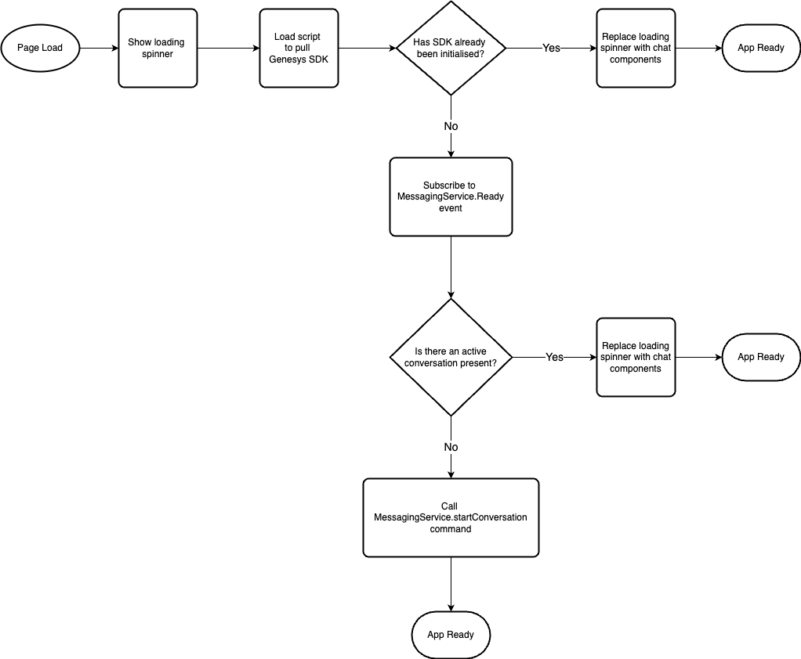
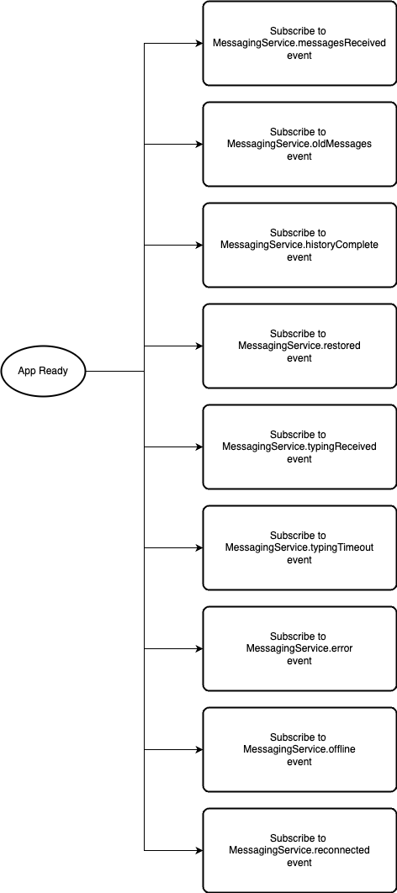
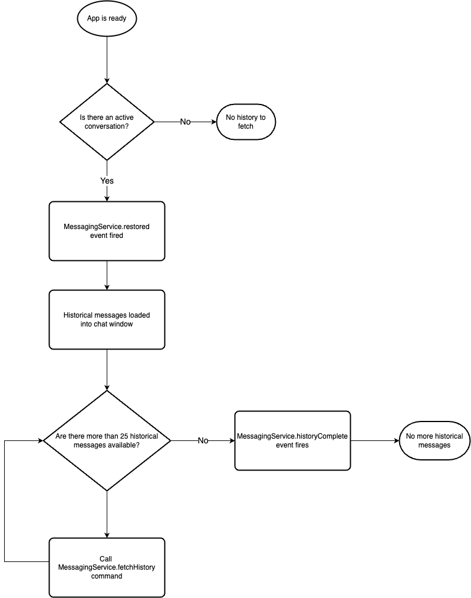
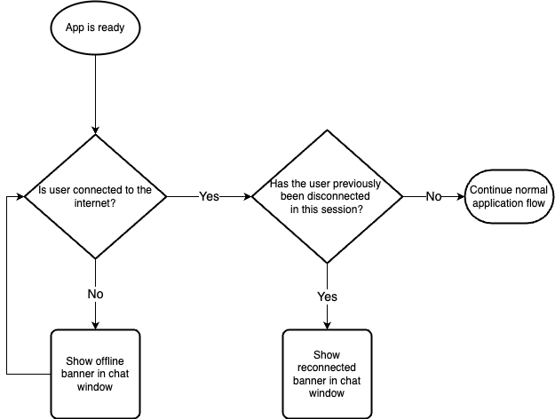

# Genesys Integration

Each web messenger integrates with Genesys Cloud's [Web Messenger](https://help.mypurecloud.com/articles/web-messaging-overview/) product. The web messenger provides automated bot responses through it's digital assistant, as well as human interaction through the live agent feature.

The service pulls in the latest version of the Genesys web messenger SDK on load, then proceeds through a flow of steps in order to check the readiness of the SDK and begin subscribing to events. 

> NOTE: Genesys does __not__ version their SDK. This is a known risk of using the Genesys SDK for live services. According to Genesys engineers, they don't update or change existing features, but rather add new ones. As a result of this, the SDK pulled into the service is always the __latest__ version (although you can find the specific version in the web socket connection).

## Genesys Integration Flows

The service subscribes to several web messenger SDK events in order to achieve the desired user experience. 

### Initial Genesys Flow

### Post Ready Flow

The post-ready flow mostly consists of subscribing to key Genesys events that support the operation and functionality of the web messengers. Once the `ready` event has fired, the rest of the SDK functions are available to be subscribed too. The core events currently subscribed to are:

- [messages received](https://developer.genesys.cloud/commdigital/digital/webmessaging/messengersdk/SDKCommandsEvents/messagingServicePlugin#messagingservice-messagesreceived)
- [old messages](https://developer.genesys.cloud/commdigital/digital/webmessaging/messengersdk/SDKCommandsEvents/messagingServicePlugin#messagingservice-oldmessages)
- [history complete](https://developer.genesys.cloud/commdigital/digital/webmessaging/messengersdk/SDKCommandsEvents/messagingServicePlugin#messagingservice-historycomplete)
- [restored](https://developer.genesys.cloud/commdigital/digital/webmessaging/messengersdk/SDKCommandsEvents/messagingServicePlugin#messagingservice-restored)
- [typing received](https://developer.genesys.cloud/commdigital/digital/webmessaging/messengersdk/SDKCommandsEvents/messagingServicePlugin#messagingservice-typingreceived)
- [typing timeout](https://developer.genesys.cloud/commdigital/digital/webmessaging/messengersdk/SDKCommandsEvents/messagingServicePlugin#messagingservice-typingtimeout)
- [error](https://developer.genesys.cloud/commdigital/digital/webmessaging/messengersdk/SDKCommandsEvents/messagingServicePlugin#messagingservice-error)
- [offline](https://developer.genesys.cloud/commdigital/digital/webmessaging/messengersdk/SDKCommandsEvents/messagingServicePlugin#messagingservice-offline)
- [reconnected](https://developer.genesys.cloud/commdigital/digital/webmessaging/messengersdk/SDKCommandsEvents/messagingServicePlugin#messagingservice-reconnected)

### Historical Messages Flow

A conversation between a user and Genesys lasts indefinitely, until the user ends that chat themselves by clicking 'End chat' and confirming. The end chat process clears down the active conversation on the Genesys side and removes all messages for that specific conversation.

When an active conversation is still in progress, every time the user visits the service, their historical messages will be loaded into the chat. By default, Genesys sends 25 histoical messages per request, so if the user has more than 25 historical messages, they can load more by clicking the 'load more messages' button which will be available at the top of their chat window.

Once all historical messages have been loaded, the `historyComplete` event will fire, indicating there is no more history to fetch, which in turn will remove the 'load more messages' button from the chat window. 

### Offline Flow

Offline support is provided in the form of a Genesys subscription, of which there are 2 parts; offline and reconnected. When a user loses connectiviy to the Genesys server (e.g. loss of internet), this will be detected on the Geensys side and the SDK will trigger the offline event. As a result of this, the web messenger will show an offline banner to the user to notify them that chat features will no longer work until they're reconnected. 

Once the user is back online, the reconnected event is triggered and the user will see an updated banner message to notify them that chat features are enabled again.

